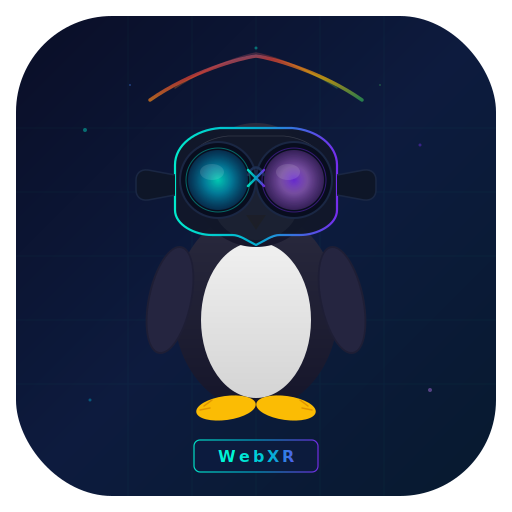
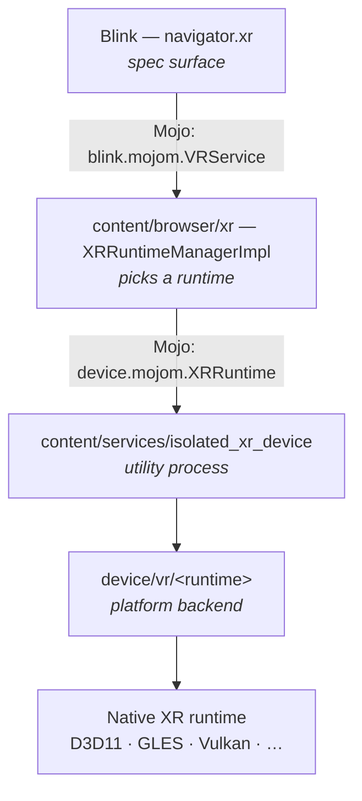
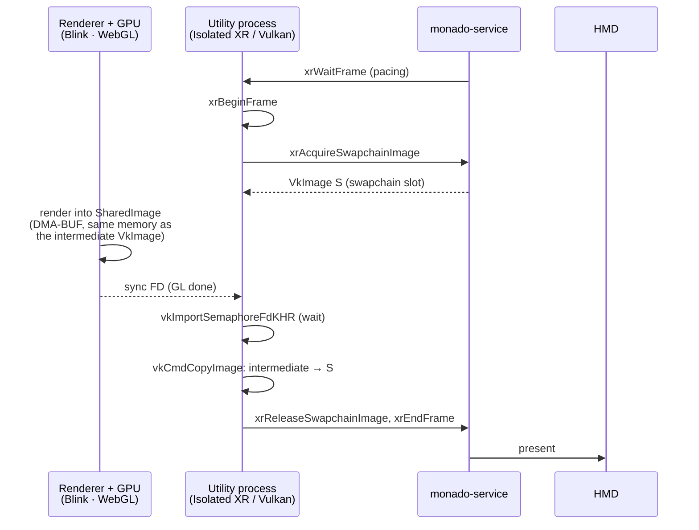
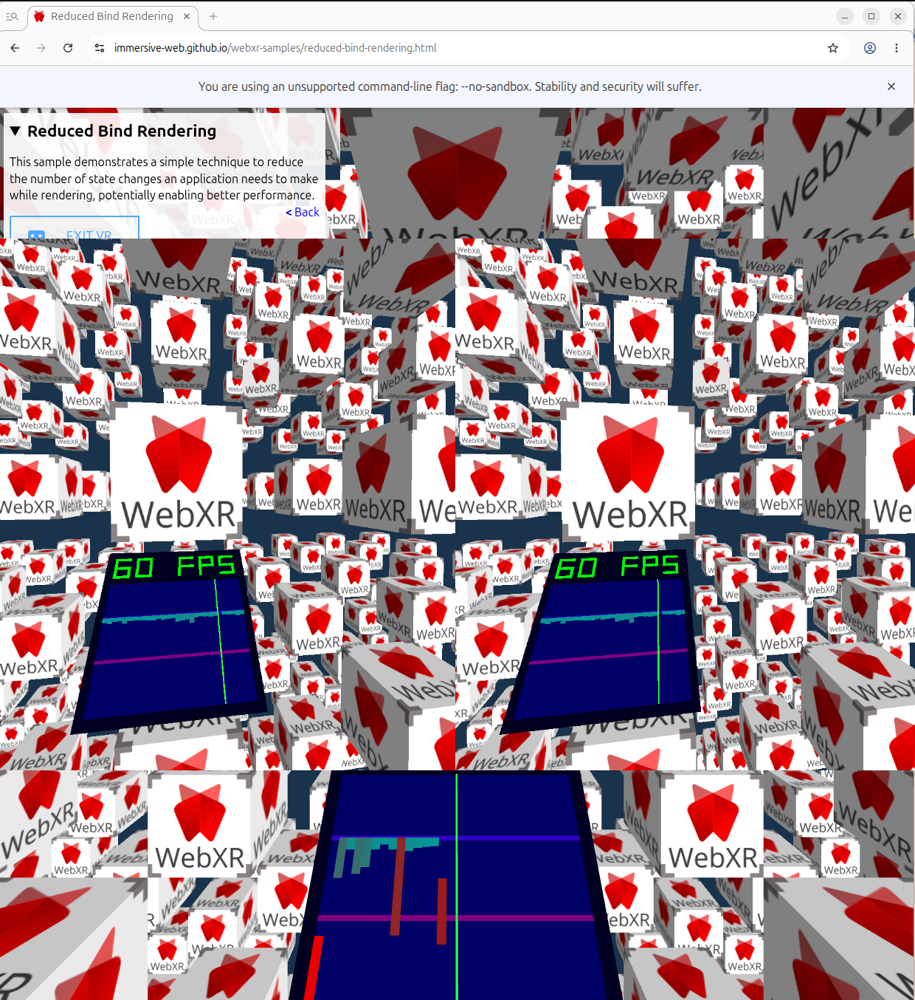

<p align="center">
  
</p>

# WebXR over OpenXR on Linux

A Chromium patch that adds WebXR immersive-vr support to Linux builds of
Chromium using the OpenXR API. Verified against [Monado], the open-source
reference OpenXR runtime.

[Monado]: https://monado.dev/

## What the patches do

This is a three-patch series — apply `0001`, `0002`, and `0003` in order.

- Implements `OpenXrPlatformHelperLinux` and `OpenXrGraphicsBindingVulkan`
  under `device/vr/openxr/linux/`.
- Uses `XR_KHR_vulkan_enable2` to create `VkInstance`/`VkDevice` via the
  OpenXR loader.
- Allocates intermediate `VkImage`s with `VK_IMAGE_TILING_LINEAR`, exports
  them as DMA-BUF (`VK_KHR_external_memory_fd` +
  `VK_EXT_external_memory_dma_buf`), and imports them into the GPU process
  as `SharedImage`s so Blink/GL can render into them.
- Each frame blits the intermediate image into the OpenXR swapchain image
  with `vkCmdCopyImage`.
- Synchronizes GL → Vulkan with `vkImportSemaphoreFdKHR` (SYNC_FD), and
  uses a persistent `VkFence` for submit/wait instead of
  `vkQueueWaitIdle`.
- Enables `device::features::kOpenXR` by default on Linux and keeps
  `XRRuntimeManagerImpl` alive across navigations so `isSessionSupported`
  does not flap during the ~5 s re-enumeration gap.
- Prepares the utility-process half of the VR browser overlay UI: the
  Vulkan graphics binding imports the overlay DMA-BUF as a `VkImage`
  (`VK_EXT_external_memory_dma_buf`) and composites it with
  `vkCmdBlitImage` to a screen-space rect per eye. **The overlay is not
  actually constructed on Linux today** — see *Known limitations*
  below.
- Adds a `--webxr-openxr-swapchain-format=rgba|bgra` switch (default `rgba`)
  to choose the swapchain channel ordering, forwarded into the isolated XR
  utility process; the swapchain `VkFormat`, exported DMA-BUF image, and
  `viz::SharedImageFormat` are kept consistent so colors are not swizzled
  (`0003`).
- Drops `SHARED_IMAGE_USAGE_SCANOUT` from the swapchain `SharedImage`s — they
  are blitted into the OpenXR swapchain, never scanned out, and requesting
  SCANOUT on a `LINEAR` (modifier 0) NativePixmap left no backing factory able
  to satisfy it, so `CreateSharedImage` returned null and the session crashed
  (`0003`).
- Falls back to a CPU `glFinish` for GL → Vulkan synchronization when the GL
  backend does not advertise `GL_CHROMIUM_gpu_fence`, so `--use-angle=vulkan`
  is no longer required — only recommended for performance (`0002`).

## Chromium WebXR architecture across platforms

WebXR in Chromium has a fixed top half that is the same on every
platform, and a platform-specific bottom half under `device/vr/` that
drives the actual XR runtime:



Platform → runtime matrix:

| Platform         | immersive-vr runtime               | immersive-ar runtime            | inline fallback                       | Source dir(s) |
| ---------------- | ---------------------------------- | ------------------------------- | ------------------------------------- | ------------- |
| Windows          | OpenXR (D3D11 binding)             | OpenXR (D3D11 binding)          | orientation sensor                    | `device/vr/openxr/{,windows}/` |
| Linux (this patch) | OpenXR (Vulkan binding)          | —                               | orientation sensor                    | `device/vr/openxr/{,linux}/`   |
| Android          | OpenXR (GLES binding) or Cardboard | OpenXR (GLES binding) or ARCore | orientation sensor                    | `device/vr/openxr/{,android}/`, `device/vr/android/{cardboard,arcore}/` |
| macOS / iOS / ChromeOS | not supported                | not supported                   | orientation sensor (where applicable) | — |

The three OpenXR ports share the heavy lifting in `device/vr/openxr/`:

- `OpenXrApiWrapper` — session, swapchain, and frame loop.
- `OpenXrPlatformHelper` — `xrCreateInstance`, extension selection,
  lifecycle, device-data query. Platform subclasses:
  `OpenXrPlatformHelperWindows`, `OpenXrPlatformHelperAndroid`,
  `OpenXrPlatformHelperLinux`.
- `OpenXrGraphicsBinding` — abstract GPU interop interface
  (`Initialize`, `GetSessionCreateInfo`, `GetSwapchainFormat`,
  `CreateSharedImages`, `RenderLayer`, `WaitOnFence`, …). Concrete
  subclasses per platform:

  | Platform | Subclass                        | Graphics API           |
  | -------- | ------------------------------- | ---------------------- |
  | Windows  | `OpenXrGraphicsBindingD3D11`    | Direct3D 11            |
  | Android  | `OpenXrGraphicsBindingOpenGLES` | OpenGL ES              |
  | Linux    | `OpenXrGraphicsBindingVulkan`   | Vulkan (this patch)    |

Each graphics binding is a few hundred to a few thousand lines of GPU
plumbing (`openxr_graphics_binding_d3d11.cc` ≈ 400 LOC,
`openxr_graphics_binding_open_gles.cc` ≈ 500 LOC,
`openxr_graphics_binding_vulkan.cc` ≈ 1400 LOC — the Vulkan one inlines
more of the bring-up). They create the native graphics device against
the OpenXR loader, allocate textures that can be exported to Chromium's
`SharedImage` (so Blink/WebGL can render into them), and bridge GPU
sync primitives between the renderer and the OpenXR compositor
(`vkImportSemaphoreFdKHR` on Linux, `ID3D11Fence` on Windows,
`EGL_ANDROID_native_fence_sync` on Android).

Non-OpenXR backends live under `device/vr/android/`:

- `cardboard/` — Google Cardboard-style stereo rendering for phones
  without an XR runtime.
- `arcore/` — ARCore-based immersive-ar session support on Android.

Inline (non-immersive) sessions are routed through
`XRRuntimeManagerImpl::GetInlineRuntime()`, which always picks the
`ORIENTATION_DEVICE_ID` runtime under `device/vr/orientation/` — a
sensor-fusion fallback. OpenXR and the other immersive backends are
not involved in inline sessions.

## Linux path in detail

Chromium runs WebXR across four cooperating processes, and talks to
Monado (a separate system process) through the OpenXR loader. The new
code lives in the utility process ("Isolated XR service"), which owns
the `VkInstance`/`VkDevice` and the OpenXR session.


Per-frame, Chromium's intermediate `VkImage` (backed by a DMA-BUF that is
also imported as a `SharedImage` in the GPU process) is the rendezvous
point between Blink's GL output and Monado's swapchain:



Data-flow angle (who hands what to whom):


## Base commits

The patch applies cleanly on top of these trees:

| Component   | Remote                                                     | Base commit   |
| ----------- | ---------------------------------------------------------- | ------------- |
| Chromium    | `https://chromium.googlesource.com/chromium/src.git`       | `b3323dffec`  |
| Monado      | `https://gitlab.freedesktop.org/monado/monado.git`         | `v25.1.0` or newer |

Other nearby Chromium commits likely apply too; if a hunk fails,
`git apply -3` (3-way merge) usually resolves the conflict.

## Prerequisites

Packages (Debian/Ubuntu):

```bash
sudo apt install -y \
  build-essential git cmake ninja-build pkg-config python3 \
  libvulkan-dev libvulkan1 vulkan-tools mesa-vulkan-drivers \
  libegl-dev libgl-dev libglx-dev \
  libx11-dev libxcb1-dev libxrandr-dev libxinerama-dev \
  libwayland-dev wayland-protocols \
  libhidapi-dev libusb-1.0-0-dev libudev-dev \
  libbsd-dev libdbus-1-dev libsystemd-dev libglvnd-dev
```

You also need Chromium's build tooling. Install [`depot_tools`] and add it
to `PATH`.

[`depot_tools`]: https://www.chromium.org/developers/how-tos/install-depot-tools/

## 1. Build and run Monado

Clone, build, install:

```bash
git clone https://gitlab.freedesktop.org/monado/monado.git
cd monado
git checkout v25.1.0          # or newer tag
cmake -B build -G Ninja \
  -DCMAKE_BUILD_TYPE=RelWithDebInfo \
  -DXRT_HAVE_OPENGL=ON \
  -DXRT_HAVE_VULKAN=ON \
  -DXRT_FEATURE_SERVICE=ON
ninja -C build
```

Start the service (terminal 1, leave it running):

```bash
rm -f /run/user/$(id -u)/monado_comp_ipc
./build/src/xrt/targets/service/monado-service
```

The service will pick up any real HMD it recognizes via hidraw/libusb.
If no hardware is attached, Monado falls back to its built-in
*simulated HMD* driver (the session will report the system name
`"Monado: Simulated HMD"` in the Chromium log) so you can still bring
up and verify the pipeline headless. See Monado's documentation for
how to force a specific driver if the auto-detection picks the wrong
one.

Verify the socket is live:

```bash
ls -l /run/user/$(id -u)/monado_comp_ipc
pgrep -af monado-service
```

Point applications at Monado's OpenXR runtime:

```bash
export XR_RUNTIME_JSON=$PWD/build/openxr_monado-dev.json
```

## 2. Fetch Chromium

```bash
mkdir chromium && cd chromium
fetch --nohooks chromium
cd src
git checkout b3323dffecb06dd4b9fc95a4d31e2928895c1140   # matches patch base
gclient sync
./build/install-build-deps.sh
```

## 3. Apply the patches

From inside `chromium/src`, apply the three-patch series in order (the glob
expands to `0001`, `0002`, `0003`):

```bash
git am /path/to/chromium-webxr-linux/000*.patch
```

If `git am` fails because of a newer Chromium base, try a 3-way merge:

```bash
git am --3way /path/to/chromium-webxr-linux/000*.patch
# resolve any conflicts, then:
git add -A && git am --continue
```

## 4. Build Chromium

Configure an output directory. OpenXR is auto-enabled on Linux by the
patch, so no extra GN args are required:

```bash
gn gen out/Default --args='is_debug=false is_component_build=true symbol_level=1'
autoninja -C out/Default chrome
```

To also run the OpenXR unit tests:

```bash
autoninja -C out/Default device_unittests
```

## 5. Run and verify

`tests/webxr-test.html` drives a WebXR immersive session. The same page
also triggers permission prompts and media captures so you can test the
VR-overlay path once that is fully wired on Linux.

With `monado-service` running in terminal 1 and the Chromium source tree
as the current directory:

```bash
XR_RUNTIME_JSON=/path/to/monado/build/openxr_monado-dev.json \
./out/Default/chrome \
  --no-sandbox \
  --allow-file-access-from-files \
  --enable-features=OpenXR \
  --use-gl=angle --use-angle=vulkan \
  --vmodule='*openxr*=3,*xr_runtime*=3,*isolated_xr*=3,*vr_ui*=3,*graphics_delegate*=3' \
  --enable-logging=stderr \
  --user-data-dir=/tmp/chrome-xr-test-profile \
  "file:///path/to/chromium-webxr-linux/tests/webxr-test.html" \
  2>&1 | tee /tmp/chrome-xr.log
```

### GPU backend — `--use-angle=vulkan`

`--use-gl=angle --use-angle=vulkan` selects ANGLE's Vulkan backend for the GPU
process. It is **recommended for performance**: it exposes a real GPU fence
(`GL_CHROMIUM_gpu_fence`, backed by `EGL_ANDROID_native_fence_sync`) so the
Vulkan compositor side does an asynchronous GPU-side wait on the WebGL render.

As of `0002` it is **no longer required**: on a GL backend that does not expose
that fence (e.g. the default ANGLE-on-GL stack), the render loop falls back to a
per-frame CPU `glFinish`, which is correct but slower. Before that fix the
session crashed (`GLES2CommandBufferStub::GetGpuFenceHandle`, *callback was
destroyed*) on the first submitted frame, so without the flag nothing rendered.
To see which path was taken, add `*openxr_render_loop*=1` to `--vmodule` and
grep the log for `GL_CHROMIUM_gpu_fence supported=`.

Whether the default backend exposes the fence depends on the Ozone platform,
because Chromium initializes ANGLE on a different native driver for each
(observed on AMD/Mesa via the unmasked WebGL renderer string):

| Ozone platform | Default ANGLE native backend | `GL_CHROMIUM_gpu_fence` |
| -------------- | ---------------------------- | ----------------------- |
| Wayland        | ANGLE on `OpenGL ES` (EGL/GBM) | supported (async fence) |
| X11            | ANGLE on desktop `OpenGL` (GLX) | absent (glFinish fallback) |

`GL_CHROMIUM_gpu_fence` requires the underlying EGL to expose
`EGL_ANDROID_native_fence_sync`. Mesa provides it on the GLES/EGL path (Wayland)
but not on the desktop-GL/GLX path (X11), so on the default backend Wayland
takes the GPU-fence path while X11 takes the `glFinish` fallback. This is a
backend-selection detail, not a Wayland-vs-X11 capability difference:
`--use-angle=vulkan` exposes the fence (via `VK_KHR_external_fence_fd`) on
both, and the `glFinish` fallback renders correctly on both regardless.

### Swapchain channel order — `--webxr-openxr-swapchain-format`

Append `--webxr-openxr-swapchain-format=bgra` to negotiate a BGRA swapchain
(`VK_FORMAT_B8G8R8A8_SRGB`) instead of the default RGBA
(`VK_FORMAT_R8G8B8A8_SRGB`); use it if a runtime/driver renders correct colors
only with BGRA channel ordering. The whole chain (swapchain `VkFormat`, the
exported DMA-BUF image, and `viz::SharedImageFormat`) follows the choice, so
colors are not swizzled. Sanity check with the page's dark-blue clear color:
blue means the channels are correct; red/brown would indicate a swizzle.

### Window system — X11 and Wayland (`--ozone-platform`)

**Both `--ozone-platform=x11` and `--ozone-platform=wayland` work**, verified at
parity against Monado on AMD RADV (real Enter VR session, ~470 frames/8 s on
X11, ~446 on Wayland — timing variance only; both stable, zero crashes, same
BGRA swapchain). This is independent of Monado's own compositor window, which
talks to Chromium over the IPC socket plus DMA-BUF FDs.

The patch shares each frame as a **linear, `modifier = 0`
(`DRM_FORMAT_MOD_LINEAR`)** DMA-BUF imported as a `gfx::NativePixmapHandle`.
Ozone/X11 imports it through the DRM render node; Ozone/Wayland imports the
same buffer through `zwp_linux_dmabuf`. Modifier 0 is correct on both because
the intermediate image is `VK_IMAGE_TILING_LINEAR`. Wayland needs no special
flags and works with the default GL backend (no `--use-angle=vulkan`); it logs
a few harmless `NOTIMPLEMENTED_LOG_ONCE()` lines (`OnTrancheFlags`, `OnName`,
…) for optional Wayland protocol callbacks that do not affect rendering.

On the page:

1. The **"immersive-vr supported"** status line should be green. If it
   still says *NOT supported* or the Enter VR button is disabled,
   Chromium did not detect the OpenXR runtime.
2. Click **Enter VR** — Monado presents a solid dark-blue frame to the
   headset (the test page's clear-color).
3. Permission prompts clicked while in VR currently surface only as
   2D dialogs on the desktop (see *Known limitations*). Exit VR to
   accept or dismiss them.
4. Press `Esc` or click **Exit VR**.

If you prefer a reference demo once the basics work, the Immersive Web
samples also exercise input tracking and room scale:

- <https://immersive-web.github.io/webxr-samples/immersive-vr-session.html>
- <https://immersive-web.github.io/webxr-samples/reduced-bind-rendering.html>
- <https://immersive-web.github.io/webxr-samples/input-tracking.html>
- <https://immersive-web.github.io/webxr-samples/room-scale.html>

<p align="center">
  
  <br>
  <em>Immersive Web's <code>reduced-bind-rendering</code> sample
  rendering stereo through Chromium → OpenXR → Monado.</em>
</p>

### Filtering the log

If detection fails, look at the utility (OpenXR) process logs:

```bash
grep -iE 'openxr|xrCreate|IsApiAvailable|IsHardwareAvailable|XR_ERROR|xrGetSystem|vulkan' /tmp/chrome-xr.log
```

Common failure signatures:

| Log line                                              | Meaning                                      | Fix                                                     |
| ----------------------------------------------------- | -------------------------------------------- | ------------------------------------------------------- |
| `xrCreateInstance ... XR_ERROR_RUNTIME_UNAVAILABLE`   | Monado service not running                   | Start `monado-service`                                  |
| `xrCreateInstance ... XR_ERROR_EXTENSION_NOT_PRESENT` | Monado build lacks `XR_KHR_vulkan_enable2`   | Rebuild Monado with `-DXRT_HAVE_VULKAN=ON`              |
| `Failed to load libvulkan.so.1`                       | No Vulkan ICD installed                      | `sudo apt install libvulkan1 mesa-vulkan-drivers`       |
| `xrGetSystem ... XR_ERROR_FORM_FACTOR_UNAVAILABLE`    | No HMD connected / no simulated driver       | Plug in HMD or start Monado with a simulated driver    |

### `chrome://xr-internals`

While Chromium is running, open `chrome://xr-internals` in a normal tab.
It lists registered runtimes and any errors reported by the isolated XR
service.

## Sandbox note

`--no-sandbox` is required in a typical developer build because the
unsanded zygote cannot attach. For production / packaged Chromium, the
standard zygote sandbox is fine — the OpenXR socket access happens in the
utility process which already has the needed syscalls allowed.

## Known limitations

**VR browser overlay UI on Linux.** Permission prompts, capture
indicators, and media-picker dialogs are *not* rendered inside the
headset yet. `ChromeXrIntegrationClient::CreateVrUiHost` returns
`nullptr` on Linux because constructing `VRUiHostImpl` walks into
`chrome/browser/vr/ui.cc` shader code that depends on `gles2_lib`'s
thread-local GL context, and `gles2::Initialize()` (which allocates
that TLS key) is only called from the VR test suite — never from the
production browser process. Attempting to use the path crashes with
a null deref on the first `glCreateShader`.

What the patch does do for the overlay:

- Reuses `chrome/browser/vr/graphics_delegate_win.{cc,h}` for the Linux
  build (the file is pure `SharedImage` + GL command buffer, not D3D),
  and `VRBrowserRendererThread::OnGraphicsReady` now bails gracefully
  when `GraphicsDelegate::BindContext()` fails instead of crashing.
- `OpenXrGraphicsBindingVulkan::SetOverlayTexture` imports the
  overlay DMA-BUF as a `VkImage` and `RenderLayer` blits it to a
  screen-space rect per eye. This code is wired and tested
  compile-side, but unreachable in practice until the browser-side
  `VRUiHostImpl` constructs successfully.

A follow-up project is needed to wire `gles2::Initialize()` into the
browser process (or move the VR UI rendering to a different GL
initialisation path that works in shipping Chromium). Once that lands,
flipping `CreateVrUiHost` to return `VRUiHostImpl` on Linux is enough
to light up the overlay end-to-end; the utility-side code is ready.

## Reporting issues

Please include:

- The Chromium base commit you patched (`git log -1 --format=%H` inside
  `chromium/src`).
- Monado version (`monado-service --version` or the tag you built).
- The filtered log from the `grep` above.
- Your GPU + Vulkan ICD (`vulkaninfo | head -40`).

## License

This repository (README, test page, and the patch file itself) is
distributed under the BSD 3-Clause license in [LICENSE](LICENSE), which
matches the license of Chromium itself. The per-file headers inside the
patch retain Chromium's own copyright notices for the files they
modify.
