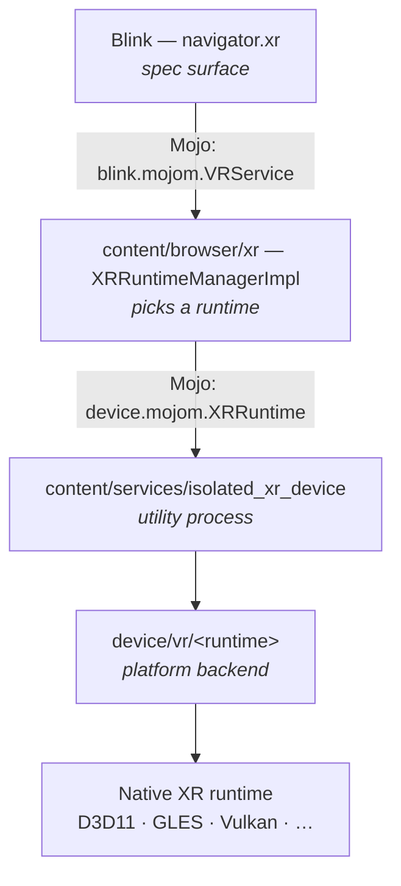
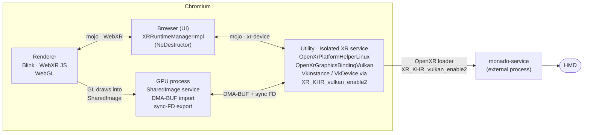
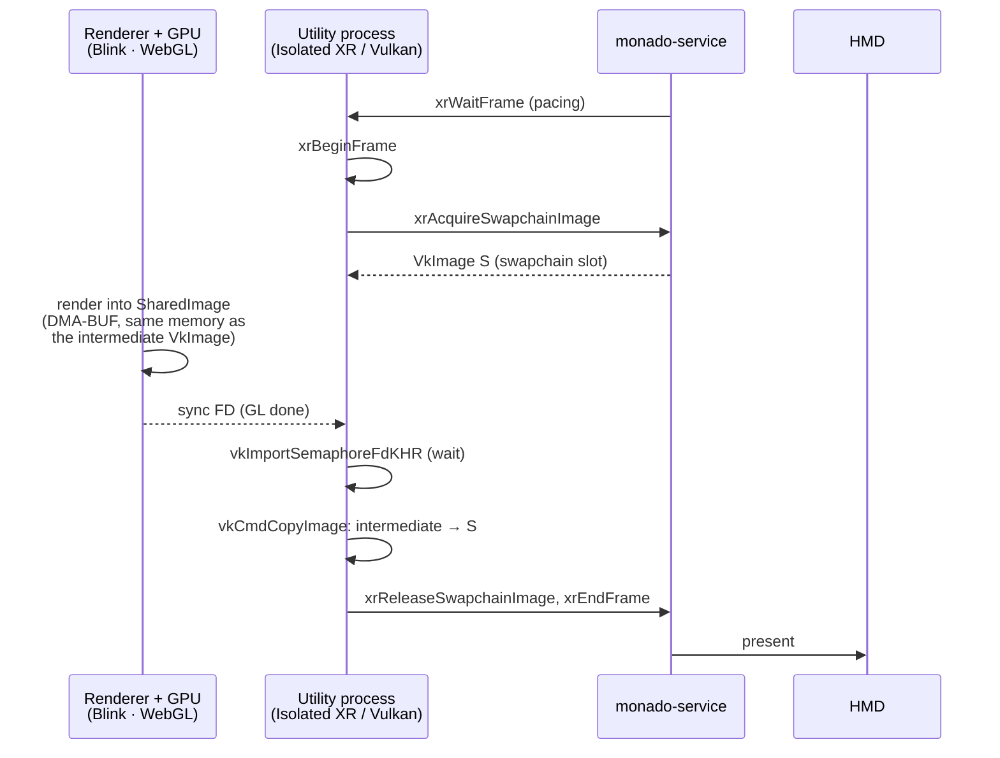
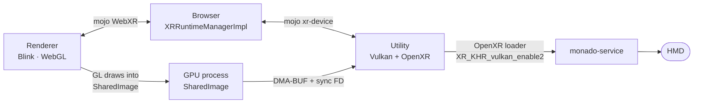
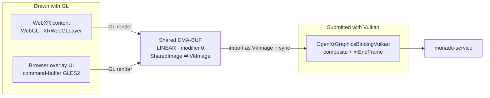
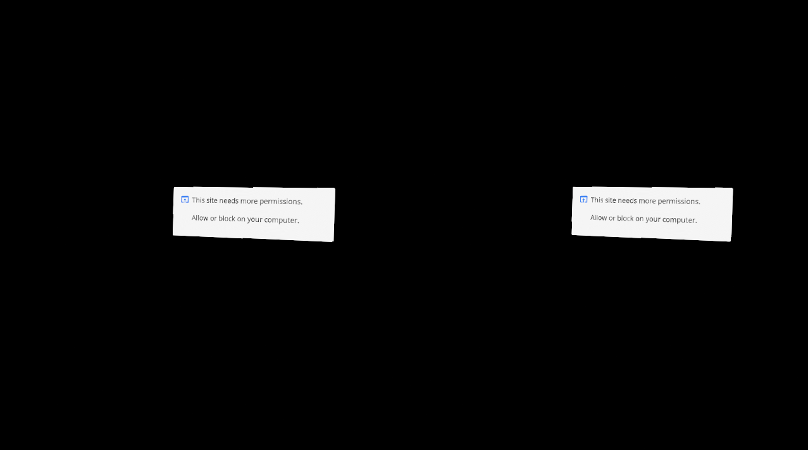
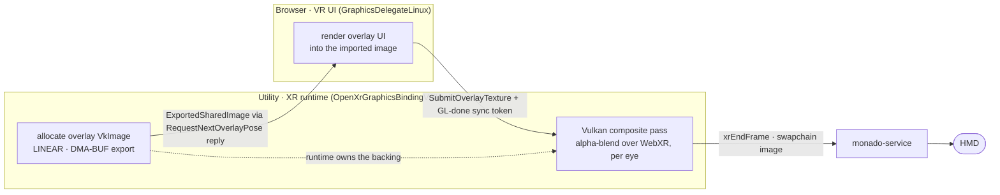
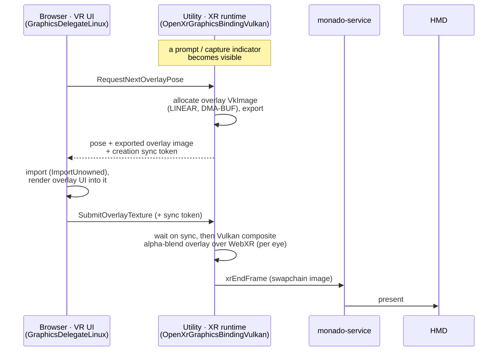

<p align="center">
  
</p>

# WebXR over OpenXR on Linux

A Chromium patch that adds WebXR immersive-vr support to Linux builds of
Chromium using the OpenXR API. Verified against [Monado], the open-source
reference OpenXR runtime.

[Monado]: https://monado.dev/

## What the patches do

This is an eight-patch series — apply `0001` through `0008` in order.

- Implements `OpenXrPlatformHelperLinux` and `OpenXrGraphicsBindingVulkan`
  under `device/vr/openxr/linux/`.
- Uses `XR_KHR_vulkan_enable2` to create `VkInstance`/`VkDevice` via the
  OpenXR loader.
- Allocates intermediate `VkImage`s with `VK_IMAGE_TILING_LINEAR`, exports
  them as DMA-BUF (`VK_KHR_external_memory_fd` +
  `VK_EXT_external_memory_dma_buf`), and imports them into the GPU process
  as `SharedImage`s so Blink/GL can render into them.
- Each frame blits the intermediate image into the OpenXR swapchain image
  with `vkCmdCopyImage`.
- Synchronizes GL → Vulkan with `vkImportSemaphoreFdKHR` (SYNC_FD), and
  uses a persistent `VkFence` for submit/wait instead of
  `vkQueueWaitIdle`.
- Enables `device::features::kOpenXR` by default on Linux and keeps
  `XRRuntimeManagerImpl` alive across navigations so `isSessionSupported`
  does not flap during the ~5 s re-enumeration gap.
- Renders the in-headset **VR browser overlay UI** — the permission
  prompts, capture indicators, and media-picker notifications shown during
  an immersive session — and composites it into the OpenXR swapchain. The
  XR runtime process allocates the overlay image and the browser renders
  the UI into it; a Vulkan composite pass alpha-blends it over the WebXR
  content per eye. See *VR browser overlay UI* below (`0007`).
- Adds a `--webxr-openxr-swapchain-format=rgba|bgra` switch (default `rgba`)
  to choose the swapchain channel ordering, forwarded into the isolated XR
  utility process; the swapchain `VkFormat`, exported DMA-BUF image, and
  `viz::SharedImageFormat` are kept consistent so colors are not swizzled
  (`0003`).
- Drops `SHARED_IMAGE_USAGE_SCANOUT` from the swapchain `SharedImage`s — they
  are blitted into the OpenXR swapchain, never scanned out, and requesting
  SCANOUT on a `LINEAR` (modifier 0) NativePixmap left no backing factory able
  to satisfy it, so `CreateSharedImage` returned null and the session crashed
  (`0003`).
- Falls back to a CPU `glFinish` for GL → Vulkan synchronization when the GL
  backend does not advertise `GL_CHROMIUM_gpu_fence`, so `--use-angle=vulkan`
  is no longer required — only recommended for performance (`0002`).
- Defaults the `checkout_openxr` gclient variable to true on Linux in `DEPS`
  so `gclient sync` actually pulls the OpenXR loader into
  `third_party/openxr`. `enable_openxr` is gated on `checkout_openxr`, so
  without this the backend was dropped from the build on a fresh Linux
  checkout even with `enable_openxr` flipped on for Linux (`0004`).
- Runs the XR Device Service **sandboxed** on Linux instead of requiring
  `--no-sandbox` for the OpenXR path: gives it the `kXrCompositing` sandbox
  type, forks it from the unsandboxed zygote, and adds a pre-sandbox hook
  (`content/utility/xr/`) that brokers the OpenXR manifest, runtime library
  and GPU/Vulkan device files, plus `XrProcessPolicy` (the GPU process
  policy plus the AF_UNIX socket syscalls the runtime uses to reach its
  compositor). See *Sandbox note* below (`0005`).
- Narrows that sandbox's file-broker policy. Instead of granting the broker
  recursive read over `/usr/lib`, `/lib` and friends so the OpenXR/Vulkan
  loaders can `dlopen()` their dependency closure after the sandbox seals,
  a pre-sandbox hook **pre-warms** the closure — it `dlopen()`s the OpenXR
  runtime and the Vulkan loader/ICDs/implicit layers with `RTLD_NOW` while
  the filesystem is still reachable, mirroring the GPU process's hook, so
  the loaders' later `dlopen()`s never reach the broker. The recursive
  grants become a narrow allow-list. See *Sandbox note* below (`0006`).
- Fixes a session-teardown crash: destroys the OpenXR input helper (whose
  controllers own action spaces that are children of the session) before
  `xrDestroySession`, so `xrDestroySpace` no longer runs on handles the
  session destroy already freed. Without this, repeatedly entering and exiting
  a session GP-faults the XR utility process on Monado and eventually takes
  down the browser (`0008`).

## Chromium WebXR architecture across platforms

WebXR in Chromium has a fixed top half that is the same on every
platform, and a platform-specific bottom half under `device/vr/` that
drives the actual XR runtime:



Platform → runtime matrix:

| Platform         | immersive-vr runtime               | immersive-ar runtime            | inline fallback                       | Source dir(s) |
| ---------------- | ---------------------------------- | ------------------------------- | ------------------------------------- | ------------- |
| Windows          | OpenXR (D3D11 binding)             | OpenXR (D3D11 binding)          | orientation sensor                    | `device/vr/openxr/{,windows}/` |
| Linux (this patch) | OpenXR (Vulkan binding)          | —                               | orientation sensor                    | `device/vr/openxr/{,linux}/`   |
| Android          | OpenXR (GLES binding) or Cardboard | OpenXR (GLES binding) or ARCore | orientation sensor                    | `device/vr/openxr/{,android}/`, `device/vr/android/{cardboard,arcore}/` |
| macOS / iOS / ChromeOS | not supported                | not supported                   | orientation sensor (where applicable) | — |

The three OpenXR ports share the heavy lifting in `device/vr/openxr/`:

- `OpenXrApiWrapper` — session, swapchain, and frame loop.
- `OpenXrPlatformHelper` — `xrCreateInstance`, extension selection,
  lifecycle, device-data query. Platform subclasses:
  `OpenXrPlatformHelperWindows`, `OpenXrPlatformHelperAndroid`,
  `OpenXrPlatformHelperLinux`.
- `OpenXrGraphicsBinding` — abstract GPU interop interface
  (`Initialize`, `GetSessionCreateInfo`, `GetSwapchainFormat`,
  `CreateSharedImages`, `RenderLayer`, `WaitOnFence`, …). Concrete
  subclasses per platform:

  | Platform | Subclass                        | Graphics API           |
  | -------- | ------------------------------- | ---------------------- |
  | Windows  | `OpenXrGraphicsBindingD3D11`    | Direct3D 11            |
  | Android  | `OpenXrGraphicsBindingOpenGLES` | OpenGL ES              |
  | Linux    | `OpenXrGraphicsBindingVulkan`   | Vulkan (this patch)    |

Each graphics binding is a few hundred to a few thousand lines of GPU
plumbing (`openxr_graphics_binding_d3d11.cc` ≈ 400 LOC,
`openxr_graphics_binding_open_gles.cc` ≈ 500 LOC,
`openxr_graphics_binding_vulkan.cc` ≈ 1400 LOC — the Vulkan one inlines
more of the bring-up). They create the native graphics device against
the OpenXR loader, allocate textures that can be exported to Chromium's
`SharedImage` (so Blink/WebGL can render into them), and bridge GPU
sync primitives between the renderer and the OpenXR compositor
(`vkImportSemaphoreFdKHR` on Linux, `ID3D11Fence` on Windows,
`EGL_ANDROID_native_fence_sync` on Android).

Non-OpenXR backends live under `device/vr/android/`:

- `cardboard/` — Google Cardboard-style stereo rendering for phones
  without an XR runtime.
- `arcore/` — ARCore-based immersive-ar session support on Android.

Inline (non-immersive) sessions are routed through
`XRRuntimeManagerImpl::GetInlineRuntime()`, which always picks the
`ORIENTATION_DEVICE_ID` runtime under `device/vr/orientation/` — a
sensor-fusion fallback. OpenXR and the other immersive backends are
not involved in inline sessions.

## Linux path in detail

Chromium runs WebXR across four cooperating processes, and talks to
Monado (a separate system process) through the OpenXR loader. The new
code lives in the utility process ("Isolated XR service"), which owns
the `VkInstance`/`VkDevice` and the OpenXR session.



Per-frame, Chromium's intermediate `VkImage` (backed by a DMA-BUF that is
also imported as a `SharedImage` in the GPU process) is the rendezvous
point between Blink's GL output and Monado's swapchain:



Data-flow angle (who hands what to whom):



## Graphics APIs: where GL is used and where Vulkan is used

This is a **hybrid GL + Vulkan** pipeline. Everything the web page and the
browser *draw* is GL; everything handed to the OpenXR runtime (Monado) is
Vulkan; the two worlds meet at a shared DMA-BUF, with no pixel copy across the
boundary.

| Part | Graphics API | How |
| --- | --- | --- |
| WebXR content (the page) | **GL** — WebGL | The page renders into an `XRWebGLLayer`; Blink drives it over the GL command buffer (`gpu::gles2::GLES2Interface`). |
| Browser overlay UI | **GL** — command-buffer GLES2 | `GraphicsDelegateLinux` renders the `chrome/browser/vr` scene graph through `gles2_c_lib`. |
| OpenXR graphics binding | **Vulkan** | `OpenXrGraphicsBindingVulkan` creates the `VkInstance`/`VkDevice` via `XR_KHR_vulkan_enable2`; the swapchain format it negotiates is a `VkFormat`. |
| Composite + submit to Monado | **Vulkan** | The base-layer copy and the overlay composite are Vulkan (embedded SPIR-V, `vkCmd…`), submitted with `xrEndFrame`. |

The **bridge** between the two is a linear, `modifier = 0`
(`DRM_FORMAT_MOD_LINEAR`) DMA-BUF: a GL context renders into a `SharedImage`
backed by that DMA-BUF, and the Vulkan binding imports the *same* buffer as a
`VkImage` (`VK_KHR_external_memory_fd` + `VK_EXT_external_memory_dma_buf`).
GL → Vulkan ordering is a sync-FD fence, or a CPU `glFinish` fallback when the
GL backend lacks `GL_CHROMIUM_gpu_fence` (see *GPU backend* below). Only the
DMA-BUF handle and a sync primitive cross the API boundary — never pixels.



**`--use-angle=vulkan` does not change this.** WebGL is still the API the page
and Blink use; ANGLE (inside the GPU process) merely *translates* those GL
commands to a native-GL or a Vulkan backend underneath, depending on the flag.
That changes how the GL is executed and which GPU-fence path you get (see *GPU
backend* below), not what WebXR renders *with*. The WebXR and overlay layers are
GL either way; only the OpenXR binding is Vulkan by construction.

Why Vulkan for the binding: Monado exposes `XR_KHR_vulkan_enable2`, and Vulkan
provides the external-memory / DMA-BUF interop needed to share buffers zero-copy
with the GPU process. The other OpenXR ports use whichever API their platform's
runtime expects — D3D11 on Windows, OpenGL ES on Android.

## Base commits

The patch applies cleanly on top of these trees:

| Component   | Remote                                                     | Base commit   |
| ----------- | ---------------------------------------------------------- | ------------- |
| Chromium    | `https://chromium.googlesource.com/chromium/src.git`       | `b3323dffec`  |
| Monado      | `https://gitlab.freedesktop.org/monado/monado.git`         | `v25.1.0` or newer |

Other nearby Chromium commits likely apply too; if a hunk fails,
`git apply -3` (3-way merge) usually resolves the conflict.

## Prerequisites

Packages (Debian/Ubuntu):

```bash
sudo apt install -y \
  build-essential git cmake ninja-build pkg-config python3 \
  libvulkan-dev libvulkan1 vulkan-tools mesa-vulkan-drivers \
  libegl-dev libgl-dev libglx-dev \
  libx11-dev libxcb1-dev libxrandr-dev libxinerama-dev \
  libwayland-dev wayland-protocols \
  libhidapi-dev libusb-1.0-0-dev libudev-dev \
  libbsd-dev libdbus-1-dev libsystemd-dev libglvnd-dev
```

You also need Chromium's build tooling. Install [`depot_tools`] and add it
to `PATH`.

[`depot_tools`]: https://www.chromium.org/developers/how-tos/install-depot-tools/

## 1. Build and run Monado

Clone, build, install:

```bash
git clone https://gitlab.freedesktop.org/monado/monado.git
cd monado
git checkout v25.1.0          # or newer tag
cmake -B build -G Ninja \
  -DCMAKE_BUILD_TYPE=RelWithDebInfo \
  -DXRT_HAVE_OPENGL=ON \
  -DXRT_HAVE_VULKAN=ON \
  -DXRT_FEATURE_SERVICE=ON
ninja -C build
```

Start the service (terminal 1, leave it running):

```bash
rm -f /run/user/$(id -u)/monado_comp_ipc
./build/src/xrt/targets/service/monado-service
```

The service will pick up any real HMD it recognizes via hidraw/libusb.
If no hardware is attached, Monado falls back to its built-in
*simulated HMD* driver (the session will report the system name
`"Monado: Simulated HMD"` in the Chromium log) so you can still bring
up and verify the pipeline headless. See Monado's documentation for
how to force a specific driver if the auto-detection picks the wrong
one.

Verify the socket is live:

```bash
ls -l /run/user/$(id -u)/monado_comp_ipc
pgrep -af monado-service
```

Point applications at Monado's OpenXR runtime:

```bash
export XR_RUNTIME_JSON=$PWD/build/openxr_monado-dev.json
```

## 2. Fetch Chromium

```bash
mkdir chromium && cd chromium
fetch --nohooks chromium
cd src
git checkout b3323dffecb06dd4b9fc95a4d31e2928895c1140   # matches patch base
gclient sync
./build/install-build-deps.sh
```

## 3. Apply the patches

From inside `chromium/src`, apply the eight-patch series in order (the glob
expands to `0001` through `0008`):

```bash
git am /path/to/chromium-webxr-linux/000*.patch
```

If `git am` fails because of a newer Chromium base, try a 3-way merge:

```bash
git am --3way /path/to/chromium-webxr-linux/000*.patch
# resolve any conflicts, then:
git add -A && git am --continue
```

Patch `0004` enables `checkout_openxr` for Linux in `DEPS`. The `gclient
sync` in step 2 ran against the unpatched `DEPS`, so it did **not** fetch
the OpenXR loader. Re-run `gclient sync` after applying the patches to pull
it into `third_party/openxr`:

```bash
gclient sync
```

## 4. Build Chromium

Configure an output directory. OpenXR is auto-enabled on Linux by the
patch, so no extra GN args are required:

```bash
gn gen out/Default --args='is_debug=false is_component_build=true symbol_level=1'
autoninja -C out/Default chrome
```

To also run the OpenXR unit tests:

```bash
autoninja -C out/Default device_unittests
```

## 5. Run and verify

`tests/webxr-test.html` drives a WebXR immersive session. The same page
also triggers permission prompts and media captures so you can exercise the
in-headset VR-overlay path (see *VR browser overlay UI* below). Every
trigger has a keyboard shortcut so you can fire it without leaving VR.

With `monado-service` running in terminal 1 and the Chromium source tree
as the current directory:

```bash
XR_RUNTIME_JSON=/path/to/monado/build/openxr_monado-dev.json \
./out/Default/chrome \
  --no-sandbox \
  --allow-file-access-from-files \
  --enable-features=OpenXR \
  --use-gl=angle --use-angle=vulkan \
  --vmodule='*openxr*=3,*xr_runtime*=3,*isolated_xr*=3,*vr_ui*=3,*graphics_delegate*=3' \
  --enable-logging=stderr \
  --user-data-dir=/tmp/chrome-xr-test-profile \
  "file:///path/to/chromium-webxr-linux/tests/webxr-test.html" \
  2>&1 | tee /tmp/chrome-xr.log
```

`--no-sandbox` here is only the base-zygote shortcut for a locally-built binary;
the OpenXR path itself runs sandboxed. Drop it once you attach the AppArmor
profile from the *Sandbox note* below.

### GPU backend — `--use-angle=vulkan`

`--use-gl=angle --use-angle=vulkan` selects ANGLE's Vulkan backend for the GPU
process. It is **recommended for performance**: it exposes a real GPU fence
(`GL_CHROMIUM_gpu_fence`, backed by `EGL_ANDROID_native_fence_sync`) so the
Vulkan compositor side does an asynchronous GPU-side wait on the WebGL render.

As of `0002` it is **no longer required**: on a GL backend that does not expose
that fence (e.g. the default ANGLE-on-GL stack), the render loop falls back to a
per-frame CPU `glFinish`, which is correct but slower. Before that fix the
session crashed (`GLES2CommandBufferStub::GetGpuFenceHandle`, *callback was
destroyed*) on the first submitted frame, so without the flag nothing rendered.
To see which path was taken, add `*openxr_render_loop*=1` to `--vmodule` and
grep the log for `GL_CHROMIUM_gpu_fence supported=`.

Whether the default backend exposes the fence depends on the Ozone platform,
because Chromium initializes ANGLE on a different native driver for each
(observed on AMD/Mesa via the unmasked WebGL renderer string):

| Ozone platform | Default ANGLE native backend | `GL_CHROMIUM_gpu_fence` |
| -------------- | ---------------------------- | ----------------------- |
| Wayland        | ANGLE on `OpenGL ES` (EGL/GBM) | supported (async fence) |
| X11            | ANGLE on desktop `OpenGL` (GLX) | absent (glFinish fallback) |

`GL_CHROMIUM_gpu_fence` requires the underlying EGL to expose
`EGL_ANDROID_native_fence_sync`. Mesa provides it on the GLES/EGL path (Wayland)
but not on the desktop-GL/GLX path (X11), so on the default backend Wayland
takes the GPU-fence path while X11 takes the `glFinish` fallback. This is a
backend-selection detail, not a Wayland-vs-X11 capability difference:
`--use-angle=vulkan` exposes the fence (via `VK_KHR_external_fence_fd`) on
both, and the `glFinish` fallback renders correctly on both regardless.

#### Why the default ANGLE backend differs by Ozone platform

It is not a deliberate per-platform choice — it is the *same* ordered
preference list resolving differently because GLX (desktop GL) is X11-only.
Tracing it through the source:

1. **Chromium queues both, desktop-GL first.** On non-Android Linux with the
   default ANGLE, `ui/gl/init/gl_display_initializer.cc` adds `ANGLE_OPENGL`
   (desktop GL) then `ANGLE_OPENGLES` (GLES) to the list of displays to try —
   identical for X11 and Wayland.
2. **First display that initializes wins.** `GLDisplayEGL::InitializeDisplay`
   (`ui/gl/gl_display.cc`) iterates that list and uses the first type that
   returns a valid `EGLDisplay`, skipping (`continue`) any that fail.
3. **ANGLE maps the desktop-GL request to GLX on X11 but native EGL on
   Wayland.** For `EGL_PLATFORM_ANGLE_TYPE_OPENGL_ANGLE` on Linux,
   `third_party/angle/src/libANGLE/Display.cpp` picks `CreateGLXDisplay()` for
   `EGL_PLATFORM_X11_EXT` and `DisplayEGL` for `EGL_PLATFORM_GBM_KHR`.

The only differing input is the native display (an X server connection vs a
Wayland/GBM display). GLX is literally the "GL X11 extension" and does not
exist on Wayland, so:

- **X11:** the desktop-GL request resolves to a GLX display, succeeds first,
  and wins → `ANGLE (…, OpenGL 4.6)`.
- **Wayland:** there is no GLX, so the request resolves to a Mesa EGL display
  that serves GLES contexts → `ANGLE (…, OpenGL ES 3.2)`.

Mesa exposes `EGL_ANDROID_native_fence_sync` on the EGL/GLES path but not on
the GLX desktop-GL path, which is exactly why `GL_CHROMIUM_gpu_fence` is
present on Wayland and absent on X11 by default. `--use-angle=vulkan` requests
`ANGLE_VULKAN` explicitly, which is window-system-independent and always
provides the fence.

### Swapchain channel order — `--webxr-openxr-swapchain-format`

Append `--webxr-openxr-swapchain-format=bgra` to negotiate a BGRA swapchain
(`VK_FORMAT_B8G8R8A8_SRGB`) instead of the default RGBA
(`VK_FORMAT_R8G8B8A8_SRGB`); use it if a runtime/driver renders correct colors
only with BGRA channel ordering. The whole chain (swapchain `VkFormat`, the
exported DMA-BUF image, and `viz::SharedImageFormat`) follows the choice, so
colors are not swizzled. Sanity check with the page's dark-blue clear color:
blue means the channels are correct; red/brown would indicate a swizzle.

### Window system — X11 and Wayland (`--ozone-platform`)

**Both `--ozone-platform=x11` and `--ozone-platform=wayland` work**, verified at
parity against Monado on AMD RADV (real Enter VR session, ~470 frames/8 s on
X11, ~446 on Wayland — timing variance only; both stable, zero crashes, same
BGRA swapchain). This is independent of Monado's own compositor window, which
talks to Chromium over the IPC socket plus DMA-BUF FDs.

The patch shares each frame as a **linear, `modifier = 0`
(`DRM_FORMAT_MOD_LINEAR`)** DMA-BUF imported as a `gfx::NativePixmapHandle`.
Ozone/X11 imports it through the DRM render node; Ozone/Wayland imports the
same buffer through `zwp_linux_dmabuf`. Modifier 0 is correct on both because
the intermediate image is `VK_IMAGE_TILING_LINEAR`. Wayland needs no special
flags and works with the default GL backend (no `--use-angle=vulkan`); it logs
a few harmless `NOTIMPLEMENTED_LOG_ONCE()` lines (`OnTrancheFlags`, `OnName`,
…) for optional Wayland protocol callbacks that do not affect rendering.

On the page:

1. The **"immersive-vr supported"** status line should be green. If it
   still says *NOT supported* or the Enter VR button is disabled,
   Chromium did not detect the OpenXR runtime.
2. Click **Enter VR** — Monado presents a solid dark-blue frame to the
   headset (the test page's clear-color).
3. Permission prompts, capture indicators, and media-picker notifications
   triggered while in VR now render **inside the headset** as an overlay
   composited over the WebXR content — you do not have to exit (see *VR
   browser overlay UI* below). The accept/deny dialog itself is a desktop
   dialog, the same as on Windows.
4. Press `Esc` or click **Exit VR**.

If you prefer a reference demo once the basics work, the Immersive Web
samples also exercise input tracking and room scale:

- <https://immersive-web.github.io/webxr-samples/immersive-vr-session.html>
- <https://immersive-web.github.io/webxr-samples/reduced-bind-rendering.html>
- <https://immersive-web.github.io/webxr-samples/input-tracking.html>
- <https://immersive-web.github.io/webxr-samples/room-scale.html>

<p align="center">
  
  <br>
  <em>Immersive Web's <code>reduced-bind-rendering</code> sample
  rendering stereo through Chromium → OpenXR → Monado.</em>
</p>

### Filtering the log

If detection fails, look at the utility (OpenXR) process logs:

```bash
grep -iE 'openxr|xrCreate|IsApiAvailable|IsHardwareAvailable|XR_ERROR|xrGetSystem|vulkan' /tmp/chrome-xr.log
```

Common failure signatures:

| Log line                                              | Meaning                                      | Fix                                                     |
| ----------------------------------------------------- | -------------------------------------------- | ------------------------------------------------------- |
| `xrCreateInstance ... XR_ERROR_RUNTIME_UNAVAILABLE`   | Monado service not running                   | Start `monado-service`                                  |
| `xrCreateInstance ... XR_ERROR_EXTENSION_NOT_PRESENT` | Monado build lacks `XR_KHR_vulkan_enable2`   | Rebuild Monado with `-DXRT_HAVE_VULKAN=ON`              |
| `Failed to load libvulkan.so.1`                       | No Vulkan ICD installed                      | `sudo apt install libvulkan1 mesa-vulkan-drivers`       |
| `xrGetSystem ... XR_ERROR_FORM_FACTOR_UNAVAILABLE`    | No HMD connected / no simulated driver       | Plug in HMD or start Monado with a simulated driver    |

### `chrome://xr-internals`

While Chromium is running, open `chrome://xr-internals` in a normal tab.
It lists registered runtimes and any errors reported by the isolated XR
service.

## Sandbox note

The OpenXR path runs **fully sandboxed**; `--no-sandbox` is not required for
it. Patch `0005` gives the XR Device Service its own Linux sandbox
(`kXrCompositing`): the service forks from the unsandboxed zygote, a
pre-sandbox hook starts a syscall broker for the OpenXR runtime manifest,
the runtime library and the GPU/Vulkan device files, and `XrProcessPolicy`
(the GPU process policy plus the AF_UNIX socket syscalls) lets the runtime
reach its compositor over the per-user IPC socket.

Patch `0006` tightens that broker's file policy. The loaders (OpenXR, Vulkan,
the Vulkan ICD) `dlopen()` their dependency closure lazily, which the initial
version served by granting the broker recursive read over `/usr/lib`, `/lib`
and `/usr/local/lib` — far broader than upstream norms. Instead, the
pre-sandbox hook now **pre-warms** that closure: right after the broker forks
(which must happen while single-threaded) it `dlopen()`s the OpenXR runtime
named by `active_runtime.json` plus the Vulkan loader, the Mesa ICDs and the
implicit layers with `RTLD_NOW | RTLD_GLOBAL`, pulling the whole transitive
`DT_NEEDED` closure into the process while the filesystem is still directly
reachable. The loaders' later `dlopen()`s then find everything resident and
never reach the broker, so the recursive grants collapse to a narrow
allow-list naming only the few libraries the loaders open by name. This mirrors
the GPU process's own pre-sandbox hook (`LoadLibrariesForGpu`).

The one thing a *developer* build still needs `--no-sandbox` for is the
**base zygote sandbox**, and that is a packaging concern unrelated to
OpenXR: a locally-built `out/Default/chrome` is not allow-listed to create
unprivileged user namespaces under Ubuntu's AppArmor restriction
(`kernel.apparmor_restrict_unprivileged_userns=1`). Packaged Chrome is
exempt via its installed AppArmor profile and setuid `chrome-sandbox`
helper. For a dev build, attach an AppArmor profile to the binary path —

```
# /etc/apparmor.d/chrome-webxr-dev  (mirrors the packaged chrome profile)
abi <abi/4.0>,
include <tunables/global>
profile chrome-webxr-dev /path/to/src/out/Default/chrome flags=(unconfined) {
  userns,
  @{exec_path} mr,
  include if exists <local/chrome-webxr-dev>
}
```

then `sudo apparmor_parser -r /etc/apparmor.d/chrome-webxr-dev` — or, less
precisely, relax the restriction globally
(`sudo sysctl -w kernel.apparmor_restrict_unprivileged_userns=0`). With the
base sandbox attached, launch **without** `--no-sandbox`.

Verified end to end against Monado with the base sandbox enabled and no
`--no-sandbox` (a DCHECK build): the XR utility runs as
`--service-sandbox-type=xr_compositing`, the broker forks, the OpenXR loader
reaches `active_runtime.json` and loads the runtime, `xrCreateInstance`
connects to Monado, the in-process Vulkan instance/device is created, the
immersive-vr session starts, the swapchain format is negotiated, and frames
are submitted to the compositor.

## VR browser overlay UI

Permission prompts, capture indicators, and media-picker notifications that
appear during an immersive session are rendered **inside the headset** as an
overlay composited over the WebXR content, so the user does not have to take the
headset off to notice them (`0007`). Trigger them from `tests/webxr-test.html`
(the *Request …* and *Start … capture* buttons, each with a keyboard shortcut so
it works from inside VR).

<p align="center">
  
  <br>
  <em>The generic permission notification rendered in-headset (left and right
  eye), composited into the OpenXR swapchain that Monado presents.</em>
</p>

How it works:

- The browser process renders the overlay UI (the same `chrome/browser/vr`
  scene graph Windows uses) through a command-buffer GL `GraphicsDelegate`. On
  Linux this is `GraphicsDelegateLinux`; the Windows delegate
  (`graphics_delegate_win`) is left untouched.
- So the overlay reaches the compositor even on frames where WebXR is hidden (a
  permission prompt hides the WebXR layer), the **XR runtime process allocates
  the overlay image** — a `LINEAR`, DMA-BUF-exportable `VkImage` — and returns
  the exported handle to the browser via a new Linux-only field on
  `ImmersiveOverlay.RequestNextOverlayPose`. The browser imports it and renders
  the UI directly into it; the runtime composites it with a Vulkan pass that
  alpha-blends the overlay over the WebXR content per eye. This mirrors how the
  WebXR base-layer image already works, so no cross-process "produce" step is
  needed and the overlay shows whether or not WebXR is visible.
- The permission **dialog** itself (allow/deny) is a desktop dialog on every
  platform; the headset shows the generic "this site needs more permissions"
  notification, the same as Windows.

Buffer ownership — the runtime owns the overlay image the browser renders into,
the inverse of a normal browser-owned texture:



Per frame, while an overlay is visible:



## Known limitations

- **immersive-ar** is not supported on Linux — there is no AR runtime binding,
  only immersive-vr.
- The in-headset overlay shows the **generic** permission notification ("this
  site needs more permissions"), not per-permission wording. This matches
  Windows; the actual allow/deny happens in the desktop dialog.

## Reporting issues

Please include:

- The Chromium base commit you patched (`git log -1 --format=%H` inside
  `chromium/src`).
- Monado version (`monado-service --version` or the tag you built).
- The filtered log from the `grep` above.
- Your GPU + Vulkan ICD (`vulkaninfo | head -40`).

## License

This repository (README, test page, and the patch file itself) is
distributed under the BSD 3-Clause license in [LICENSE](LICENSE), which
matches the license of Chromium itself. The per-file headers inside the
patch retain Chromium's own copyright notices for the files they
modify.
